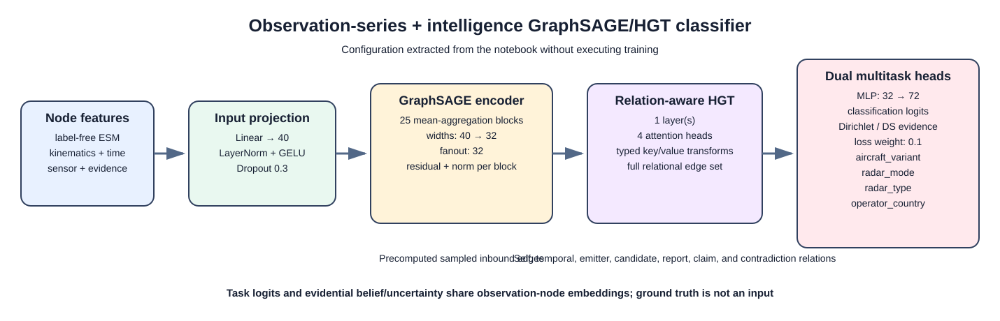

# Advanced notebook neural-network diagram

The diagram below represents the classifier defined in
`notebooks/observation_series_and_intel_rgcn_classification_advanced_network.ipynb`.
It shows the feature projection, the configured GraphSAGE receptive-field depth,
the relation-aware HGT refinement, and the four observation-level task heads.



## Regenerating the diagram

Run the dependency-free generator from the repository root:

```bash
python scripts/generate_advanced_network_diagram.py
```

The generator parses the notebook's Python cells with `ast`; it does **not** run
data preparation or model training. Literal model settings and `TARGETS` are
therefore reflected in the SVG whenever the notebook configuration changes.
It also checks that the notebook still defines the GraphSAGE block, HGT layer,
and combined classifier, failing clearly if the expected architecture has been
removed or renamed.

An alternate notebook or output path can be supplied when comparing variants:

```bash
python scripts/generate_advanced_network_diagram.py \
  --notebook notebooks/observation_series_and_intel_rgcn_classification_advanced_network.ipynb \
  --output /tmp/network.svg
```

The SVG is suitable for Markdown, browsers, presentations, and conversion to a
raster format. Its labels describe both the tensor-processing path and the
typed graph edges used by the advanced notebook.
