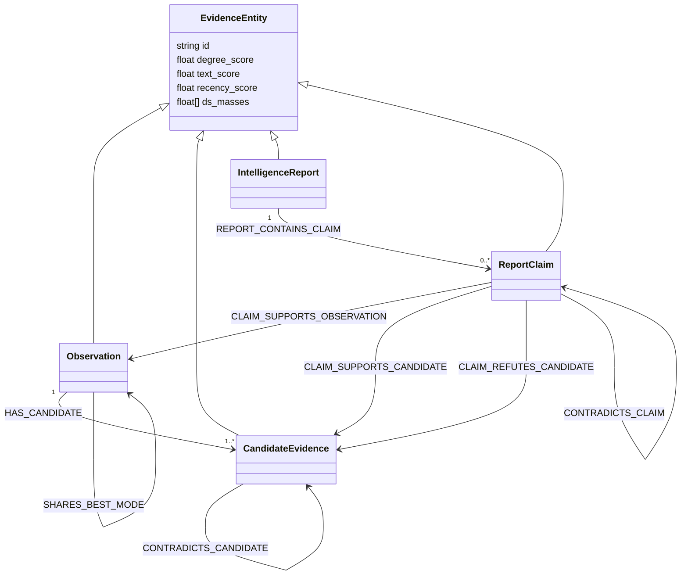
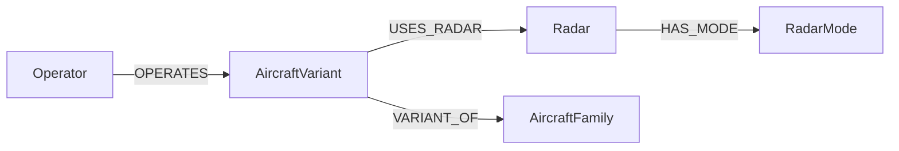

# Evidence Graph Ontology

For an assessment of this model and the canonical aircraft/radar graph against
the W3C SKOS framework, including a proposed terminology-layer migration, see
[SKOS alignment assessment](skos_alignment.md).

This note describes the ontology materialised in Neo4j by the observation and
intelligence-report ETL pipelines. It is a descriptive schema of the current
implementation, rather than a separate OWL/RDF ontology. The evidence graph is
kept distinct from the canonical aircraft/radar knowledge graph so that claims,
measurements, uncertainty, and provenance do not become asserted domain facts.

## Conceptual view

All evidence nodes carry the common `EvidenceEntity` label. A second label
identifies the kind of evidence, allowing one query over the complete evidence
subgraph or narrower queries over a particular kind.



`EvidenceEntity` is therefore an umbrella label, not an extra node between the
four concrete node kinds.

## Node kinds

### `Observation`

An ESM measurement event. Its stable graph identifier has the form
`evidence:observation:<observation_id>`.

| Property group | Properties | Meaning |
| --- | --- | --- |
| Identity and time | `id`, `observation_id`, `series_id`, `sequence_index`, `elapsed_time_s`, `timestamp_iso8601` | Event identity, track membership, and temporal ordering. |
| Shared model inputs | `degree_score`, `text_score`, `recency_score` | Candidate density, best-candidate score, and time-decay score. |
| Evidence target | `ds_masses` | Dempster-Shafer mass vector in `[non_match, match, uncertain]` order. |
| Best inferred candidate | `best_candidate_mode_id`, `best_candidate_aircraft_id`, `best_candidate_score` | The highest-scoring candidate generated by the ETL. These are inferences, not ground truth. |
| Optional evaluation labels | `radar_id`, `mode_id`, `aircraft_id`, `operator` | Ground-truth labels copied only when truth-label ingestion is explicitly enabled. |

By default, truth metadata in generated input is not copied to an observation
node. This prevents evaluation truth from leaking into model features or
targets.

### `CandidateEvidence`

A scored hypothesis for one observation, identified as
`evidence:candidate:<observation_id>:<rank>`. It represents a proposed
radar-mode, radar, aircraft, and operator combination derived from the base KG.

| Property group | Properties | Meaning |
| --- | --- | --- |
| Identity and ordering | `id`, `observation_id`, `series_id`, `sequence_index`, `rank` | Candidate identity and its position in the observation's ranking. |
| Hypothesis | `mode_id`, `radar_id`, `aircraft_id`, `operator` | Domain entities proposed by the candidate. Values are identifiers/properties, not evidence-to-KG edges. |
| Scores | `mode_score`, `aircraft_score`, `degree_score`, `text_score`, `recency_score` | Match quality and shared model inputs. |
| Evidence target | `ds_masses` | Candidate Dempster-Shafer masses in `[non_match, match, uncertain]` order. |
| Consistency and ambiguity | `speed_consistency_score`, `altitude_consistency_score`, `heading_consistency_score`, `observation_uncertainty_width`, `candidate_ambiguity_count` | Contextual agreement and uncertainty features. |
| Detailed matching features | Interval-overlap, waveform/scan match, residual, and missing-feature properties | Fine-grained features emitted by candidate scoring for model use. |

### `IntelligenceReport`

A provenance-bearing source report, identified as
`evidence:report:<report_id>`. It records `report_id`, `series_id`, `source_id`,
`source_type`, `published_at`, `collected_at`, `credibility_score`, and the
shared evidence properties. Its `ds_masses` encode report credibility adjusted
for recency.

### `ReportClaim`

An extracted assertion from an intelligence report, identified as
`evidence:claim:<claim_id>`.

| Property group | Properties | Meaning |
| --- | --- | --- |
| Identity and provenance | `id`, `claim_id`, `report_id`, `series_id` | Claim identity, its containing report, and the observation series to which the report applies. |
| Assertion | `claim_type`, `stance`, `object_id`, `object_value` | The kind of assertion, whether it supports or refutes the object, and the canonical identifier or literal value being asserted. |
| Source and extraction quality | `credibility_score`, `claim_confidence`, `extraction_confidence` | Reliability of the source, the assertion itself, and the extraction process. |
| Shared model inputs | `degree_score`, `text_score`, `recency_score` | Common numeric features; `text_score` is the blended claim-support score and `recency_score` applies time decay. |
| Evidence target | `ds_masses` | Claim Dempster-Shafer masses in `[non_match, match, uncertain]` order; the uncertainty allocation depends on the claim stance. |

The supported claim vocabulary is:

- `operator`
- `aircraft_variant`
- `aircraft_family`
- `radar_type`
- `radar_mode`
- `location`
- `relation`

A claim remains evidence about an object; it does not create or overwrite a
canonical KG fact.

## Relationship kinds

| Relationship | Direction | Properties | Semantics |
| --- | --- | --- | --- |
| `HAS_CANDIDATE` | `Observation` → `CandidateEvidence` | `score`, `rank` | Associates an observation with a ranked hypothesis. |
| `next_observation` | earlier `Observation` → immediately following `Observation` | none | Provides forward temporal adjacency within a series. The notebook graph derives it by sorting observations on `sequence_index`. |
| `prev_observation` | later `Observation` → immediately preceding `Observation` | none | Provides the reverse relation for temporal message passing without treating `next_observation` as symmetric. |
| `same_emitter` | `Observation` ↔ `Observation` | none | Reinforces track continuity between non-adjacent observations from the same emitter series. The notebook graph currently adds a pair of directed edges between observations two samples apart. |
| `CONTRADICTS_CANDIDATE` | stronger `CandidateEvidence` → weaker `CandidateEvidence` | `score_delta`, `reason` | Marks incompatible candidate hypotheses for the same observation when their score difference crosses the configured threshold. `reason` lists differing hypothesis fields. |
| `GROUND_TRUTH_CANDIDATE` | `Observation` → `CandidateEvidence` | none | Evaluation-only link to a candidate matching the supplied truth. It exists only when truth ingestion is enabled and should normally be excluded from leakage-safe training. |
| `SHARES_BEST_MODE` | `Observation` ↔ `Observation` | none | A pair of directed edges between observations whose best candidate has the same radar mode. This is candidate-derived and may also be excluded from leakage-safe training. |
| `REPORT_CONTAINS_CLAIM` | `IntelligenceReport` → `ReportClaim` | none | Preserves claim provenance. |
| `CLAIM_SUPPORTS_OBSERVATION` | `ReportClaim` → `Observation` | `score`, `stance` | Applies a scored report claim only to observations passing its report's proximity test. The historical relationship name is retained even when `stance` is not `supports`; consumers must inspect `stance`. |
| `CLAIM_SUPPORTS_CANDIDATE` | `ReportClaim` → `CandidateEvidence` | `compatibility`, `claim_score`, `contribution`, `match_basis` | Direct positive, candidate-specific intelligence evidence. `compatibility` is already final and signed; stance must not be applied again. |
| `CLAIM_REFUTES_CANDIDATE` | `ReportClaim` → `CandidateEvidence` | `compatibility`, `claim_score`, `contribution`, `match_basis` | Direct negative, candidate-specific intelligence evidence. |
| `CONTRADICTS_CLAIM` | stronger `ReportClaim` → weaker `ReportClaim` | `score_delta`, `reason` | Connects claims of the same type that refer to different object identifiers; direction follows claim score. |
| `REPORT_NEAR_OBSERVATION` | `IntelligenceReport` → `Observation` | `match_basis`, `time_delta_s`, `distance_km` | Connects sightings by time and coordinates and patterns of life by time and expected operating area. |
| `REPORT_APPLIES_TO_TRACK` | `IntelligenceReport` → `Track` | none | Marks a report as applicable when it has at least one proximity-qualified observation on the track. |
| `TRACK_HAS_OBSERVATION` | `Track` → `Observation` | none | Materializes the series/track hierarchy for report applicability and downstream pooling. |
| `CLAIM_ASSERTS_KG_ENTITY` | `ReportClaim` → aircraft/radar/operator KG node | `claim_type`, `stance`, `score` | Grounds a structured intelligence assertion in an existing canonical KG entity. |

Relationship direction is part of the r-GCN relation semantics. In particular,
contradiction edges point from the stronger item to the weaker one; they should
not be assumed to be symmetric.

The lowercase temporal relations (`next_observation`, `prev_observation`, and
`same_emitter`) are constructed by the series-classification notebooks for the
in-memory r-GCN graph. The Neo4j observation ETL currently preserves the
`series_id` and `sequence_index` needed to derive them, but does not materialise
these three relationships. Their uppercase spellings in design notes describe
the same concepts; relation names passed to the current notebook models are
lowercase and case-sensitive.

## Connection to the canonical knowledge graph

Candidate discovery reads this domain path from the base KG:



The evidence writer stores selected domain identifiers as properties rather
than creating direct edges to canonical KG nodes. Claims do create direct
support/refutation edges to the uncertain `CandidateEvidence` hypotheses, not
to canonical nodes. Consequently:

1. the base KG supplies candidate hypotheses and technical bounds;
2. `Observation`, `CandidateEvidence`, `IntelligenceReport`, and `ReportClaim`
   retain uncertain and potentially contradictory evidence;
3. the r-GCN consumes typed evidence relationships and numeric properties; and
4. predicted masses and classifications are outputs, not new canonical facts.

## Intelligence-aware candidate ranking

Observation ETL quality-scores available series claims and fuses them with all
KG candidates before limiting the shortlist or producing candidate nodes. The
report ETL can subsequently materialise provenance nodes and edges and
idempotently refresh the fusion fields in three stages:

1. **Final signed compatibility.** Exact operator, aircraft, radar, and mode
   identifiers are compared with each candidate. Aircraft-family claims use the
   canonical `VARIANT_OF` path resolved during ingestion. A positive value means
   net support and a negative value means net refutation; no second stance sign
   is applied. Refutation of a different alternative receives only a small
   positive discount rather than full support.
2. **Provenance-aware aggregation and DS fusion.** All direct graph edges are
   retained, but scalar evidence uses only the strongest absolute contribution
   per `source_id`. Support, refutation, conflict, coverage, and uncertainty are
   stored separately. Candidate-specific claim masses are combined with sensor
   masses using Dempster's rule; total conflict is exposed without writing an
   invalid mass vector.
3. **Graph and learned-ranking inputs.** The bounded intelligence score is
   blended with the original `sensor_score` using a default maximum weight of
   0.15. `HAS_CANDIDATE.score` and rank are set from the fused score during
   candidate creation; report ingestion later materialises direct
   claim/candidate relations. The component scores are available as
   recommended numeric r-GCN features. This preserves the sensor-only score for
   explanations, ablations, and learned re-ranking experiments.

## Dempster-Shafer interpretation

The ETL's two-hypothesis frame stores three masses:

1. `non_match` — support that the item does not match the hypothesis;
2. `match` — support that it matches; and
3. `uncertain` — mass assigned to the whole frame rather than either singleton.

Each vector is non-negative and normalized to sum to one. Training can use a
different configured hypothesis frame, but the stored ETL vectors must match
the frame and ordering expected by that run.

## Identity, constraints, and query contract

Neo4j uniqueness constraints are created for `EvidenceEntity.id`,
`Observation.id`, and `CandidateEvidence.id`. Report and claim nodes also use
globally prefixed `EvidenceEntity.id` values and are merged on that identifier.
The standard training contract queries nodes through `EvidenceEntity`, reads
numeric feature properties plus `ds_masses`, and treats the Neo4j relationship
type as the r-GCN relation type.

A compact inspection query is:

```cypher
MATCH (source:EvidenceEntity)-[relationship]->(target:EvidenceEntity)
RETURN labels(source) AS source_labels,
       type(relationship) AS relation,
       labels(target) AS target_labels,
       count(*) AS occurrences
ORDER BY relation, source_labels, target_labels;
```

This query is also a practical way to detect schema drift after either ETL is
changed.
